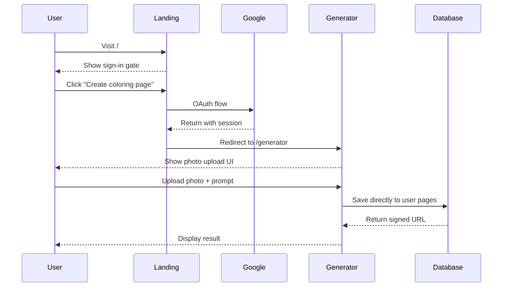
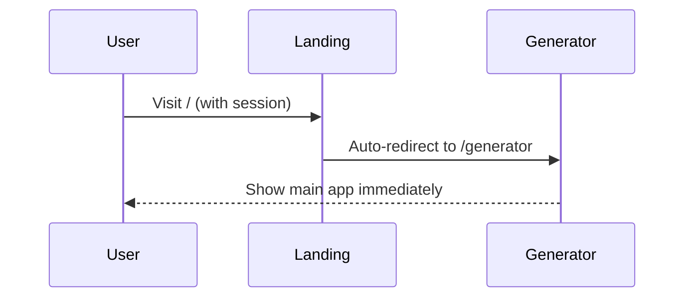

# Auth-First Implementation Plan
## Eliminating Anonymous Flow for Coloring Book App

### Overview
This plan transforms the app from anonymous-optional to auth-required, simplifying the codebase and creating a cleaner user experience. All functionality now requires Google OAuth authentication upfront.

---

## 1. Core Changes Summary

| Current State | New State |
|---------------|-----------|
| Anonymous generation → Optional auth | Auth-required → Direct generation |
| Complex temp/user storage buckets | Single `pages` bucket with user folders |
| Landing page with full functionality | Landing page with sign-in gate only |
| Optional user accounts | Mandatory Google OAuth |
| Complex middleware logic | Simple auth wall |

---

## 2. Supabase Infrastructure Changes

### 2.1 Database Migrations

**Migration: `20250702_001_remove_anonymous_infra.sql`**
```sql
-- Remove anonymous-related infrastructure
drop trigger if exists on_auth_user_created on auth.users;
drop function if exists copy_latest_temp_to_user();

-- Remove temp storage policies
drop policy if exists "temp_pages_public_read" on storage.objects;
drop policy if exists "temp_pages_anon_upload" on storage.objects;

-- Update pages bucket policies (rename user-pages → pages)
create policy "User uploads to own folder"
on storage.objects for insert
with check (
  bucket_id = 'pages'
  and regexp_replace(name, '/.*', '') = auth.uid()::text
);

create policy "User downloads own files"
on storage.objects for select
using (
  bucket_id = 'pages'
  and regexp_replace(name, '/.*', '') = auth.uid()::text
);

-- Optimize pages table index
create index if not exists idx_pages_user_created_active 
on pages(user_id, created_at desc) 
where deleted_at is null;
```

### 2.2 Storage Bucket Changes
- **Delete**: `temp-pages` bucket entirely
- **Rename**: `user-pages` → `pages` 
- **Structure**: `pages/{user_id}/{page_id}.jpg`
- **Policies**: Path-based RLS using `auth.uid()`

### 2.3 Authentication Settings
- **Disable**: "Enable anonymous users" in Supabase Dashboard
- **Required**: Google OAuth provider only (primary)
- **Optional**: Magic link as secondary option
- **MFA**: Keep optional for premium users

---

## 3. Frontend Architecture Overhaul

### 3.1 New Page Structure
```
app/
├── layout.tsx                 # Global nav for auth users
├── page.tsx                   # Landing: Sign-in gate only
├── generator/
│   └── page.tsx              # Main app (auth-required)
├── dashboard/
│   └── page.tsx              # User history (auth-required)
├── api/v1/
│   ├── createJob/route.ts    # Now auth-required
│   └── my-pages/route.ts     # Auth-required
└── middleware.ts             # Simplified auth wall
```

### 3.2 Landing Page (`app/page.tsx`)
**For Non-Authenticated Users:**
- Hero section with first attached image design
- Primary CTA: "Create your coloring page" → triggers Google OAuth
- Explanation copy about Stanford Children's Hospital donations
- No scroll-through functionality
- Clean, focused sign-in experience

**Copy Template:**
```
Welcome to Coloring Pages
crafted from their imagination

Create personalized, printable black and white coloring pages 
with your child's photos.

[Create your coloring page] ← Google OAuth trigger

───
Why sign in?
We're a simple app helping families turn pictures into fun coloring pages. 
All proceeds go to Stanford Children's Hospital. Requiring accounts helps us:
• Provide proper tax documentation for your donations
• Prevent abuse and maintain quality
• Save your creations securely

Sorry for the added step – it helps us help kids! 🏥
```

### 3.3 Main App (`app/generator/page.tsx`)
**For Authenticated Users:**
- Second attached image design (photo upload interface)
- Full generation workflow
- Integrated navigation bar
- All current functionality preserved

### 3.4 Navigation Component
**New: `components/layout/Navigation.tsx`**
```tsx
// Sticky nav bar for authenticated users
- Logo/brand
- "Generator" (current)
- "My Pages" (dashboard)
- User menu (avatar, settings, sign out)
- Credit display (current: X credits)
```

---

## 4. Component Changes

### 4.1 Components to Remove
- ❌ `components/auth/AuthModal.tsx` (replaced by landing page)
- ❌ Anonymous-specific logic in generation service
- ❌ "Save this page" upsell banners
- ❌ Temp storage management utilities

### 4.2 Components to Update
- ✅ `components/auth/AuthButton.tsx` → `AuthUserMenu.tsx` (avatar dropdown only)
- ✅ `components/forms/PhotoUpload.tsx` (remove anonymous handling)
- ✅ `components/layout/Hero.tsx` (auth-gate version)

### 4.3 New Components Needed
- 🆕 `components/auth/GoogleSignInButton.tsx`
- 🆕 `components/layout/Navigation.tsx` 
- 🆕 `components/auth/SignInCallout.tsx` (explanation section)

---

## 5. API Route Changes

### 5.1 Updated `api/v1/createJob/route.ts`
```typescript
export async function POST(request: Request) {
  // MUST have valid JWT - no anonymous logic
  const { data: { user }, error } = await supabase.auth.getUser();
  if (!user) {
    return new Response('Unauthorized', { status: 401 });
  }

  // Direct save to pages/{user.id}/ bucket
  // Direct INSERT to pages table
  // No temp storage, no copy logic
  
  return Response.json({ 
    pageId, 
    signedUrl: `pages/${user.id}/${pageId}.jpg` 
  });
}
```

### 5.2 Remove Anonymous Endpoints
- ❌ Any endpoint that handled anonymous users
- ❌ `/auth/callback` temp-to-user copy logic
- ❌ Anonymous rate limiting (now user-based)

---

## 6. Middleware Simplification

### 6.1 New `middleware.ts`
```typescript
const PUBLIC_PATHS = [
  '/',           // Landing page (sign-in gate)
  '/favicon.ico',
  '/robots.txt',
  '/_next/static/',
  '/api/auth/'   // Supabase auth endpoints
];

export async function middleware(req: NextRequest) {
  const res = NextResponse.next();
  const supabase = createMiddlewareClient({ req, res });
  const { data: { session } } = await supabase.auth.getSession();

  const path = req.nextUrl.pathname;
  
  // Redirect unauthenticated users to landing
  if (!session && !isPublicPath(path)) {
    const redirectUrl = req.nextUrl.clone();
    redirectUrl.pathname = '/';
    redirectUrl.searchParams.set('redirectedFrom', path);
    return NextResponse.redirect(redirectUrl);
  }

  // Redirect authenticated users away from landing
  if (session && path === '/') {
    return NextResponse.redirect(new URL('/generator', req.url));
  }

  return res;
}
```

---

## 7. User Experience Flow

### 7.1 New User Journey


### 7.2 Returning User Journey


---

## 8. Data Migration Strategy

### 8.1 Existing User Data
- ✅ Keep all existing `pages` table data
- ✅ Preserve `user-pages/` storage bucket contents
- ❌ Delete `temp-pages/` bucket after one-time migration

### 8.2 One-Time Migration Script
```typescript
// Optional: Migrate any orphaned temp files to user accounts
// Run once before deleting temp-pages bucket
export async function migrateOrphanedTempFiles() {
  // Find temp files that match registered user emails
  // Move to appropriate user folders
  // Create pages table entries
  // Clean up temp bucket
}
```

---

## 9. Testing Strategy

### 9.1 E2E Test Updates
**Remove:**
- Anonymous user flow tests
- Temp storage tests
- Auth upgrade flow tests

**Add:**
- Auth gate enforcement tests
- Direct generation after auth tests
- Navigation flow tests

**Update:**
- All existing generation tests to assume authentication

### 9.2 Test Matrix
| Scenario | Expected Result |
|----------|----------------|
| Visit `/generator` without auth | Redirect to `/` |
| Sign in with Google | Redirect to `/generator` |
| Generate image after auth | Direct save to user bucket |
| Access another user's files | 403 Forbidden |
| Sign out | Redirect to `/` |

---

## 10. Implementation Order

### Phase 1: Infrastructure (1-2 days)
1. ✅ Apply database migration
2. ✅ Update Supabase storage policies  
3. ✅ Delete temp-pages bucket
4. ✅ Update auth settings (disable anonymous)

### Phase 2: Backend (1 day)
1. ✅ Update middleware.ts
2. ✅ Rewrite `/api/v1/createJob` route
3. ✅ Remove anonymous logic from all APIs
4. ✅ Update generation service

### Phase 3: Frontend (2-3 days)
1. ✅ Create new landing page
2. ✅ Add navigation component
3. ✅ Update generator page
4. ✅ Remove unnecessary auth components
5. ✅ Add Google sign-in integration

### Phase 4: Testing (1 day)
1. ✅ Update E2E tests
2. ✅ Verify auth flows
3. ✅ Test generation pipeline
4. ✅ Security verification

### Phase 5: Deployment (0.5 days)
1. ✅ Run migration in production
2. ✅ Deploy new code
3. ✅ Monitor for issues
4. ✅ Clean up old storage

---

## 11. Risk Mitigation

### 11.1 Potential Issues
- **User confusion**: Clear messaging about why auth is required
- **Conversion drop**: Streamlined Google OAuth to minimize friction  
- **Data loss**: Careful migration of existing temp files
- **SEO impact**: Landing page still indexable but focused on conversion

### 11.2 Rollback Plan
- Keep migration scripts reversible
- Maintain backup of temp-pages bucket until confirmed stable
- Feature flag for emergency anonymous mode restoration

---

## 12. Success Metrics

### 12.1 Technical Metrics
- ✅ Zero anonymous generation attempts
- ✅ All API endpoints require valid JWT
- ✅ Storage properly secured with RLS
- ✅ Clean middleware logic (< 50 lines)

### 12.2 User Experience Metrics
- 🎯 Auth conversion rate > 70%
- 🎯 Time to first generation < 60 seconds post-auth
- 🎯 Zero security vulnerabilities
- 🎯 Core Web Vitals maintained

---

## 13. Post-Implementation Cleanup

### 13.1 Code Cleanup
- Remove all anonymous-related conditional logic
- Delete unused components and utilities
- Update TypeScript types to remove optional user contexts
- Clean up environment variables (remove anonymous keys)

### 13.2 Documentation Updates
- Update AGENT.md with new auth-first flow
- Revise API documentation
- Update deployment guides
- Create user onboarding documentation

---

This plan transforms the app into a cleaner, more focused experience while maintaining all core functionality and improving security posture.
