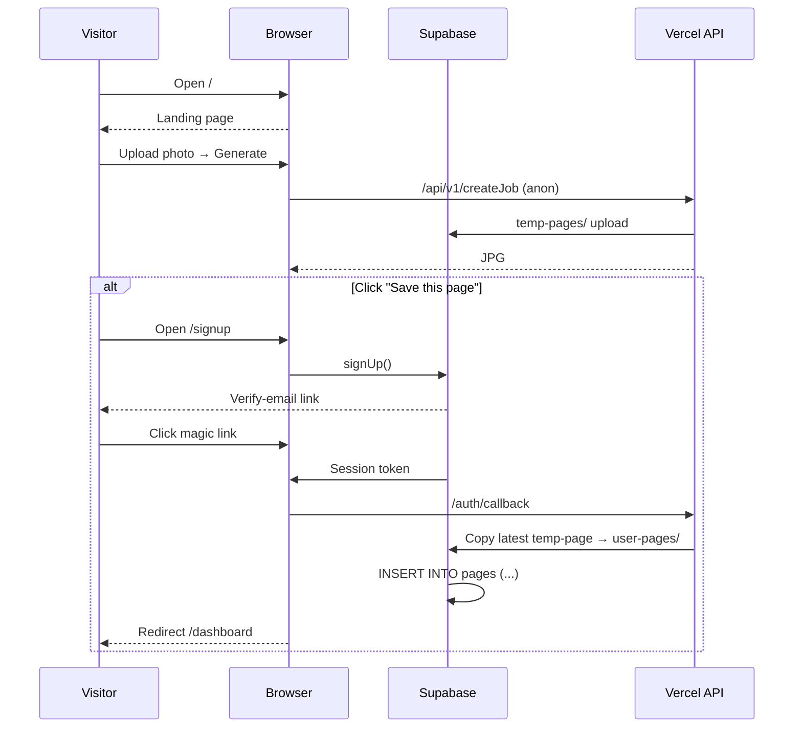

# Authentication Implementation Plan - Phase 5

## 1 · Objective & Success Criteria

| Area | Target Outcome |
|------|----------------|
| Accounts | Google, GitHub, and Magic‑Link sign‑up / sign‑in; mandatory e‑mail verification; optional MFA. |
| Anonymous Continuity | Existing anonymous generation flow remains untouched. |
| Data Persistence | Authenticated pages auto‑saved; anonymous pages remain in temp-pages/ until upgrade or 24 h GC. |
| User Dashboard | Authenticated users view, download, and soft‑delete page history. |
| Security & Compliance | Supabase Row‑Level Security (RLS) and Storage policies; GDPR/COPPA adherence; 100 req/min/IP rate‑limit on auth endpoints. |
| UX Consistency | Water‑color aesthetic, Playfair/Lato typography, no emojis in UI. |

## 2 · High‑Level Flow



## 3 · Deliverables & File Map

```
src/
├── app/
│   ├── auth/
│   │   ├── callback/route.ts          # Session exchange + temp→user copy
│   │   └── signout/route.ts
│   ├── dashboard/
│   │   └── page.tsx                   # User dashboard (history grid)
│   └── api/v1/
│       └── my-pages/route.ts          # GET pages with RLS
├── components/
│   ├── auth/
│   │   ├── AuthModal.tsx              # Social + magic‑link
│   │   ├── AuthButton.tsx
│   │   └── UserMenu.tsx
│   └── dashboard/
│       ├── PageHistory.tsx
│       └── PageCard.tsx
├── lib/
│   ├── supabase/
│   │   ├── client.ts
│   │   ├── server.ts
│   │   └── useAuth.ts                 # React hook (was hooks/useAuth.ts)
│   └── auth.ts                        # JWT helpers, role utils
├── middleware.ts                       # JWT + role extraction
└── database/
    └── migrations/
        ├── 20250628_003_create_pages_table.sql
        └── 20250628_004_pages_rls.sql
```

## 4 · Database & Storage Tasks

### 4.1 Pages Table (Migration 003)

```sql
create table pages (
  id          uuid primary key default uuid_generate_v4(),
  user_id     uuid references auth.users not null,
  prompt      text,
  style       text,
  jpg_path    text,
  pdf_path    text,
  deleted_at  timestamp,
  created_at  timestamp default now()
);

create unique index idx_pages_user_created
  on pages (user_id, created_at desc);
```

### 4.2 RLS & Policies (Migration 004)

```sql
alter table pages enable row level security;

create policy pages_user_is_owner
  on pages for all
  using (auth.uid() = user_id);
```

### 4.3 Storage Buckets

| Bucket | ACL | Notes |
|--------|-----|-------|
| temp-pages/ | Public read | Files auto‑deleted after 24 h Cloud Function. |
| user-pages/ | Private | Signed URL (1 h TTL) for downloads. |

Policy example:

```sql
create policy "Only owner download"
on storage.objects for select
using (
  bucket_id = 'user-pages'
  and owner = auth.uid()
);
```

### 4.4 Trigger: Copy Temp → User

```sql
create function copy_latest_temp_to_user()
returns trigger as $$
begin
  insert into pages(...)
  -- copy object via storage api
  return new;
end;
$$ language plpgsql;

create trigger on_auth_user_created
after insert on auth.users
execute procedure copy_latest_temp_to_user();
```

## 5 · Middleware & Security

| Concern | Implementation |
|---------|----------------|
| JWT verification | middleware.ts uses @supabase/auth-helpers/nextjs to fetch session. |
| Public vs Protected | Allow /, /login, /signup, /api/v1/analyze-photo, static assets. |
| Rate limit | Edge helper: 100 req/min/IP on /auth/v1/token. |
| CSP & headers | helmet in custom server; deny inline scripts. |
| Soft Delete | Dashboard hides rows where deleted_at is not null; storage GC job purges objects ≥30 days old. |

## 6 · UI / UX Specifications

| Element | Spec Compliance |
|---------|-----------------|
| AuthModal.tsx | Use shadcn `<Dialog>`; heading Playfair Display, body Lato; primary button bg-indigo-500 → hover bg-indigo-600; no emojis. |
| AuthButton.tsx | Shows "Sign In" (anon) or avatar dropdown (auth). |
| PageCard.tsx | Ivory background #FCF8F3, gentle shadow, watercolor border. |
| Dashboard Grid | Responsive masonry; 2‑col ≥640 px, 4‑col ≥1024 px. |
| CTA Upsell | After generation, banner "Save this page forever" with Google + Magic‑Link buttons. |

## 7 · Testing Matrix

| Scenario | Expected Result |
|----------|-----------------|
| Google OAuth happy‑path | User lands on /dashboard with copied temp page. |
| Magic‑link expired | Displays "Link expired; request new link". |
| RLS bypass attempt (curl) | 403. |
| User A fetches User B page | 0 rows returned. |
| Soft‑delete page | deleted_at set, file still downloadable via admin only. |
| Anonymous flow regression | No auth redirects; generation still works. |

e2e tests live under `tests/e2e/auth.spec.ts` (Playwright, Chromium & Safari).

## 8 · Implementation Order of Work

1. Migrations 003‑004 → apply in dev.
2. Storage policies → configure via SQL.
3. Trigger copy_latest_temp_to_user.
4. Middleware.ts update (JWT + publicPaths).
5. Auth UI components → AuthModal, AuthButton, UserMenu.
6. /auth/callback route (session exchange & copy).
7. Dashboard pages & components.
8. Generation service update (auto‑save when user_id).
9. Edge rate‑limit & helmet headers.
10. Tests & CI Gate (npm run test:e2e).

## 9 · Hand‑off Checklist for AI Agent

- [ ] Apply two new migrations & verify RLS.
- [ ] Add bucket policies + soft‑delete GC job.
- [ ] Implement trigger + /auth/callback.
- [ ] Build specified components with style guide.
- [ ] Update middleware & rate‑limit logic.
- [ ] Ship e2e tests; ensure green CI.

Once these tasks are complete, Phase 5 is DONE and we proceed to Phase 6 – PDF Export.
